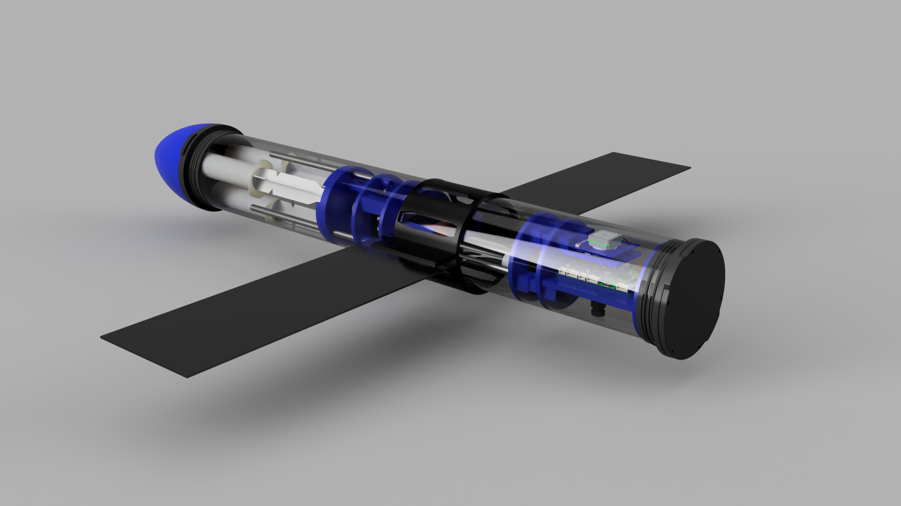
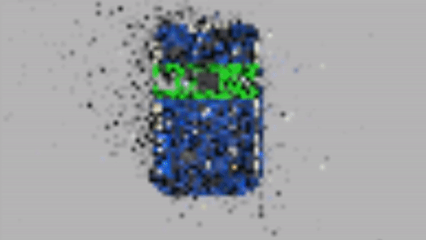

# OceanAI

Welcome to the official open-source documentation and resource page for the OceanAI project.

## Getting started
This page contains all the resources and information necessary to recreate this project on your own.
### Prerequisites
* [KiCad EDA](https://www.kicad.org/)
* [Visual Studio Code](https://code.visualstudio.com/)
* [PlatformIO](https://platformio.org/)
* [Google Colab](https://colab.research.google.com/?utm_source=scs-index)
* [Python](https://www.python.org/)
* [Autodesk Fusion360](https://www.autodesk.com/products/fusion-360/overview)

## The Plan
The plan for OceanAI is to develop an autonomous underwater vehicle (AUV) and use Computer Vision to identify and map objects in the ocean, while also collecting important data. Everything from the printed circuit board running our own software will be developed and posted here.
### Main things to come!
* Fully finished and optimized sub software.
* Fully trained computer vision model (still training)
* Finished submarine.

## Directory Guide 

CAD

<ul>
  <li>Contains compressed CAD .step files of the submarine</li>
  <li>Dependencies hold external designs that were imported when designing the submarine</li>
  <li>The design is pretty much finalized now!</li>
</ul>
    

PCBs

<ul>
  <li>Contains all the files and fabrication outputs of the PCBs used in this porject</li>
  <li>main_board is the pcb that controls the submarine</li>
  <li>Transmitter is a pcb that is connected to the submarine above water to transmit and receive data</li>
</ul>
    
    <h3>This directory does not contain the external dependencies used in this project! These will be added later.</h3>

Vision

<ul>
  <li>Contains the Notebook that guides you in creating a custom YOLOv5 model</li>
   <h3>See the <a href="https://github.com/daniel360kim/OceanAI/blob/master/Vision/README.md">README</a> for more info and a tutorial!</h3>
</ul>
    
   

software

<ul>
  <li>Contains two directories: <a href="https://github.com/daniel360kim/OceanAI/tree/master/software/receiver_driver">receiver_driver</a> and <a href=">https://github.com/daniel360kim/OceanAI/tree/master/software/sub_driver">sub_driver</a></li>
  <li>sub_driver contains all the code that controls the submarine</li>
  <li>receiver_driver runs code that receives transmitted data from the submarine and displays the image in a GUI</li>

</ul>
    
   

