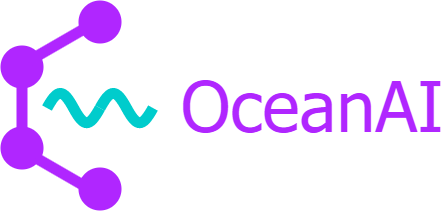
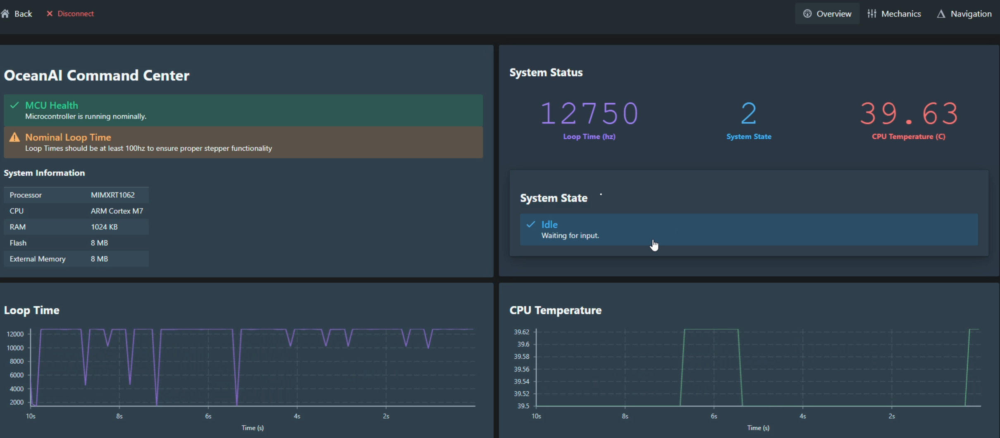

<!-- Project Logo -->
<div align="center">

<a href="https://github.com/daniel360kim/OceanAI">
    
</a>
  <h1 align="center">OceanAI</h1>
  
  <p align="center">
    A robotic and software orientated ocean development.
    <br />
    <a href="https://www.youtube.com/watch?v=8TJVxcPY-2g&t=32s&ab_channel=NMRocketry"><strong>See the video »</strong></a>
    <br />
    <br />
  </p>
</div>

<br>
  <h2>Table of Contents</h2>
  <ol>
    <li>
      <a href="#about-the-project">About The Project</a>
    </li>
    <li>
      <a href="#getting-started">Getting Started</a>
      <ul>
        <li><a href="#AUV Software">AUV Software</a></li>
        <li><a href="#Graphical User Interface">Graphical User Interface</a></li>
      </ul>
    </li>
    <li><a href="#license">License</a></li>
    <li><a href="#contact">Contact</a></li>
  </ol>


# About the Project
This project aims at creating an autonomous underwater vehicle (AUV) that utilizes cameras, sensors, a microcontroller, and GPS to categorize, identify, and map underwater trash. Detection of litter will be performed with a deep learning model - optimized to run on a microcontroller - allowing for cheap and power-efficient inference of underwater footage.

Main components of the project include:
* [AUV Control Board](https://github.com/daniel360kim/OceanAI/tree/master/PCBs)
* [AUV Software](https://github.com/daniel360kim/OceanAI/tree/master/software/sub_driver)
* [AUV CAD Model](https://github.com/daniel360kim/OceanAI/tree/master/CAD)
* [Deep Learning Model](https://github.com/daniel360kim/OceanAI/tree/master/software/detection_model)

# Getting Started
## AUV Software
[VSCode](https://code.visualstudio.com/) and
[PlatformIO](https://platformio.org/) are used to build and upload the software to the AUV.
1. Install VSCode and the PlatformIO extension.
2. Clone the repository.
```sh
git clone https://github.com/daniel360kim/OceanAI.git
```
3. Go to PlatformIO home and go to the 'Projects' tab.
4. Click 'Add Existing Project' and select the `software/sub_driver` folder.
5. Make sure you have the Teensy 4.1 core installed.
6. Connect the AUV through USB and click the 'Upload' button.
<br></br>


## Graphical User Interface


<br></br>
The GUI is built using [ElectricUI](https://electricui.com/). ElectricUI requires:
* [Node.js](https://nodejs.org/en/)
* [Yarn](https://yarnpkg.com/)

1. Install Node.js, [available from their website](https://nodejs.org/en/).
2. Install Yarn.
```sh
npm install -g yarn
```
3. Install ElectricUI, [available here](https://registry.eui.io/arc/latest/arc_latest_windows_amd64.msi)
4. Check everything installed and can be found in your PATH
```sh
arc info
```
5. Clone the repository if you haven't already.
```sh
git clone https://github.com/daniel360kim/OceanAI.git
```
6. Open the GUI project with ElectricUI. `software/auv_gui`
7. Run the GUI.
```sh
arc start
```


# License
Distributed under the MIT License. See `LICENSE` for more information.

# Contact
* Daniel Kim - nmrs.thrust@gmail.com - [YouTube](https://www.youtube.com/channel/UC0VazqJrUQiJGd_Tedn47zA) - Instagram: @us_rockets
* Project Link: https://github.com/daniel360kim/OceanAI 
