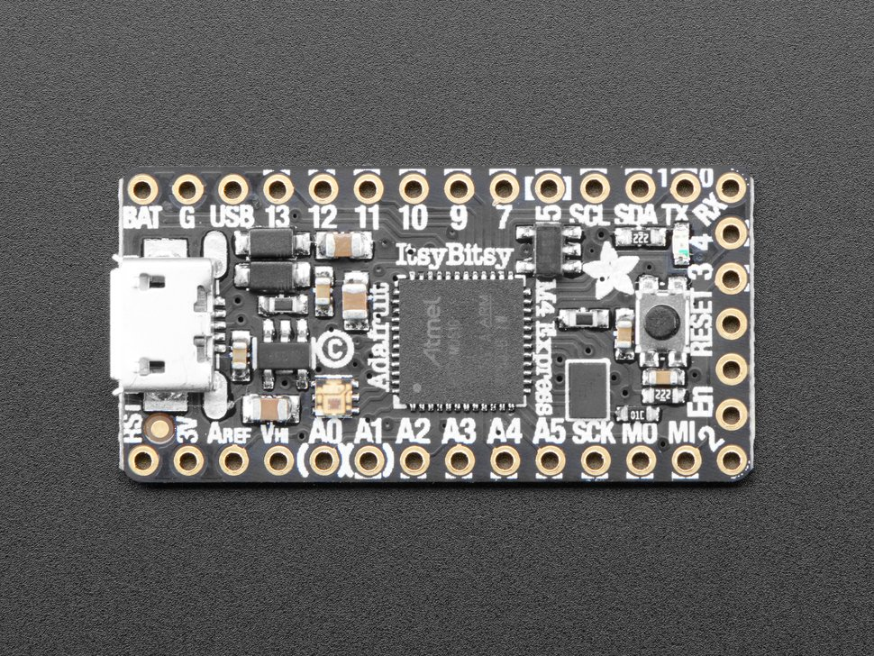
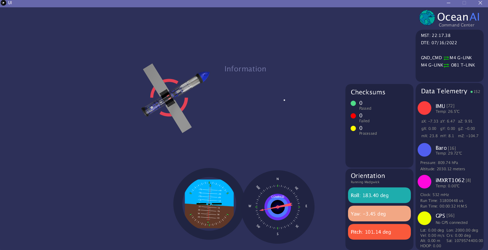

# Receiver
The submarine transmits data through the external NRF24L01. The data is then received by this module and printed through an external GUI (to come).

## MCU
This software runs on the [Adafruit ItsyBitsy M4](https://www.adafruit.com/product/3800) - but should work on most supported Arduino boards. 

The NRF24L01 module is connected through hardware SPI, with interchangeable CS pins within software.

## How it works:

* Data is received and saved to a data struct.
* The data is then sent through Serial to a desktop or laptop.
* The received data is then parsed and displayed through a GUI (to come!)

### Preview of the GUI
